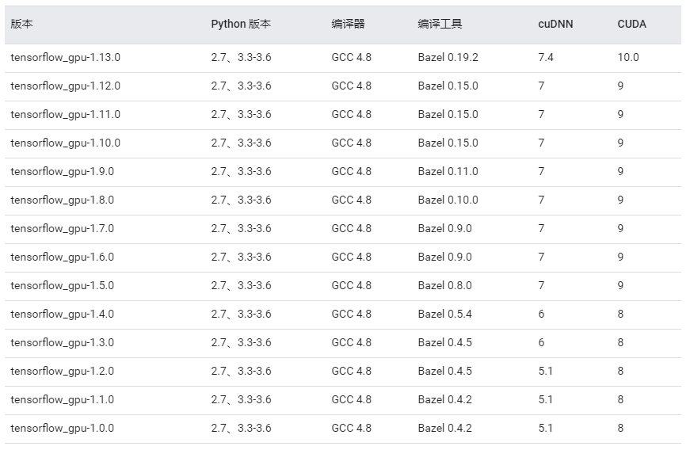
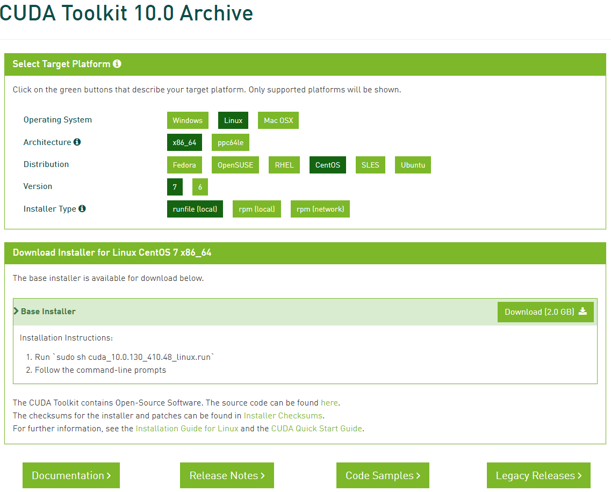

### Tensorflow GPU 安装指南

#### tensorflow-gpu与cuDNN/CUDA版本对应关系(官方验证，建议安装CUDA 9.x版本，比较新且稳定)



#### CUDA与Nvidia Driver版本对应关系


#### 先决条件 (10.10.87.76) 

- GPU型号：GTX 1080 
- gcc/g++版本：gcc version 4.8.5 20150623 (Red Hat 4.8.5-36) (GCC)
- cuda [[3]][3] 版本： CUDA Version 10.1.105  (cat /usr/local/cuda/version.txt)
- cudnn [[1]][1] 版本：7.5.1 (cat /usr/local/cuda/include/cudnn.h | grep CUDNN_MAJOR -A 2)
- tensorflow-gpu版本：1.13.1 ( conda install tensorflow-gpu=1.13.1)
- anaconda版本： 3-5.0.1 
- CentOS版本：CentOS Linux release 7.5.1804 (Core) (cat /etc/redhat-release )

#### 安装配置

##### XGboost-gpu安装

```sh
conda create --name xgboost-gpu python=3.6
conda install -c anaconda py-xgboost-gpu=0.80 
```


##### Tensorflow-gpu安装

```sh
conda create --name tf-gpu python=3.6
conda install -c anaconda tensorflow-gpu=1.31.1
```

---

### CentOS 7 安装GTX 1070 ti 驱动、CUDA、cuDNN、tensorflow-gpu

#### 先决条件(10.10.88.203)

- GPU型号：GTX 1070Ti [[4]][4] (https://www.geforce.com/whats-new/articles/nvidia-geforce-gtx-1070-ti) 
- CentOS版本：CentOS Linux release 7.6.1810 (Core) (cat /etc/redhat-release)
- gcc/g++版本：gcc version 6.2.0 (GCC)
- GTX 1070Ti 显卡驱动 [[2]][2] 版本：418.56 （>=410.48） (https://www.geforce.com/drivers)
- cuda repo [[3]][3] 版本：10.0.130 (https://developer.nvidia.com/cuda-10.0-download-archive?target_os=Linux&target_arch=x86_64&target_distro=CentOS&target_version=7&target_type=runfilelocal)
- cudnn [[1]][1] 版本：7.4.2 (https://developer.nvidia.com/rdp/cudnn-download)
- tensorflow-gpu版本：1.13.0


#### 前期准备

- 查看系统内核版本：

  - ``` sh
    uname -r
    ```

- 检查PCIe上是否已经挂载GPU：

  - ```sh
    lspci |grep NVIDIA
    #04:00.0 VGA compatible controller: NVIDIA Corporation GP104 [GeForce GTX 1070 Ti] (rev a1)
    #04:00.1 Audio device: NVIDIA Corporation GP104 High Definition Audio Controller (rev a1)
    ```

  - ```sh
    lspci |grep -i VGA 
    ```

- 配置yum源：

  - ```sh
    sed -i 's/enabled=1/enabled=0/' /etc/yum/pluginconf.d/fastestmirror.conf
    yum -y install yum-utils
    ```

- (Optional)禁用yum插件：

  - ```sh
    yum-config-manager --disable updates
    ```

- 安装epel源：

  - ```sh
    yum -y install epel-release
    ```

- 屏蔽nouveau驱动: nouveau是系统自带的显示驱动程序，需要首先禁用，否则在安装显卡驱动时会提示```You appear to be running an X server …```

  - ```sh
    # vim /etc/modprobe.d/nvidia-installer-disable-nouveau.conf
    # vim /lib/modprobe.d/nvidia-installer-disable-nouveau.conf
    blacklist nouveau
    options nouveau modeset=0
    ```

  - ```sh
    # or
    cat << EOF > /etc/modprobe.d/nvidia-installer-disable-nouveau.conf
    # generated by nvidia-installer
    blacklist nouveau
    options nouveau modeset=0
    EOF
    ```

- (Optional)移除默认显卡内核模块：

  - ```sh
    # 验证nouveau是否运行，若有输出，则在运行
    lsmod | grep nouveau  
    # 若nouveau运行，执行如下命令关闭
    modprobe -r nouveau
    ```

- 关闭X server: 

  - ```sh
    systemctl stop gdm.service
    ```

- 重做initramfs镜像 (生成不带nouveau显卡模块的内核镜像):

  - ```sh
    cp /boot/initramfs-$(uname -r).img /boot/initramfs-$(uname -r).img.bak
    dracut /boot/initramfs-$(uname -r).img $(uname -r)
    ```

- 安装与内核版本匹配的gcc、kernel-devel、kernel-headers：

  - ```sh
    yum -y install gcc kernel-devel kernel-headers
    ```

#### 安装NVIDIA官方驱动(For GTX 1070 ti)

- 下载GTX 1070ti对应的NVIDIA显卡驱动：

  - 从[[2]][2] https://www.geforce.com/drivers上选择匹配GTX 1070ti、Linux 64-bit的v-418.56下载，得到文件```NVIDIA-Linux-x86_64-418.56.run```;

- 运行```NVIDIA-Linux-x86_64-418.56.run```文件以安装显卡驱动：

  - ```sh
    bash NVIDIA-Linux-x86_64-418.56.run
    ```

- Note: 

  - 若显卡驱动安装失败 使用这个命令查看内核版本和devel版本是否一致： ``` rpm -qa | grep kernel ```;

- 验证：

  ```sh
  nvidia-smi
  ```

  

#### 安装CUDA

- 下载CUDA toolkits 10.0.130：

  - 从[[3]][3] https://developer.nvidia.com/cuda-toolkit-archive 上选择匹配的CUDA repo，我们选择```（rpm(local)）```的安装方式，得到```cuda-repo-rhel7-10-0-local-10.0.130-410.48-1.0-1.x86_64.rpm```文件，如下图所示：

    

- 安装CUDA repo RPM文件(cuda-repo-rhel7-10-0-local-10.0.130-410.48-1.0-1.x86_64.rpm) [Install repository meta-data]：

  - ```sh
    rpm -ivh cuda-repo-rhel7-10-0-local-10.0.130-410.48-1.0-1.x86_64.rpm
    # Clean Yum repository cache
    yum clean expire-cache
    ```

- 安装CUDA：

  - ```sh
    yum install cuda
    ```

- 安装cuda-tools, cuda-runtime, cuda-compiler, cuda-libraries, cuda-libraries-dev, cuda-drivers，详细的cuda packages如下图所示：

  

  - ```sh
    yum install -y cuda-toolkits-10-0.x86_64 cuda-tools-10-0.x86_64 cuda-runtime-10-0.x86_64 cuda-compiler-10-0.x86_64 cuda-libraries-10-0.x86_64 cuda-libraries-dev-10-0.x86_64 cuda-drivers-10-0.x86_64 --skip-broken
    ```

    

- (Optional)如果必要，增加```libcuda.so```软连接：

  - The libcuda.so library is installed in the /usr/lib{,64}/nvidia directory. For preexisting projects which use libcuda.so, it may be useful to add a symbolic link from libcuda.so in the /usr/lib{,64} directory.

- 默认安装在```/usr/local/cuda-10.0/```下，建立软连接：

  - ```sh
    ln -s /usr/local/cuda-10.0/ /usr/local/cuda
    ```

- 配置CUDA的环境变量：

  - ```sh
    echo 'export PATH=$PATH:/usr/local/cuda/bin' >> /etc/profile
    source /etc/profile
    echo 'source /etc/profile' >> /etc/.bashrc
    ```

- 验证CUDA安装是否成功：

  - ```sh
    nvidia-smi 
    #输出如下图
    ```

    

  - 编译执行`main.cu`测试程序【附件中】：

    ```sh
    nvcc --version
    nvcc main.cu -o main
    ./main # 正常情况下，输出结果如下图所示，则为cuda安装成功
    ```

    

  - `main.cu`具体代码如下：

    ```c++
    #include<stdio.h>
    #include<cuda_runtime.h>
    
    bool init_cuda(){
    	int count;
    	cudaGetDeviceCount(&count);
    	if(0 == count) {
    		fprintf(stderr, "There is no device \n");
    		return false;
    	}
    
    	int i;
    	for(i = 0; i < count; i++) {
    		cudaDeviceProp prop;
    		if(cudaSuccess == cudaGetDeviceProperties(&prop, i)) {
    			if(prop.major >= 1){
    				break;
    			}
    		}
    	}
    
    	if(i == count){
    		fprintf(stderr, "There is no device supporting CUDA 1.x.\n");
    		return false;
    	}
    
    	cudaSetDevice(i);
    
    	return true;
    }
    
    int main() {
    	if(!init_cuda()) {
    		return 0;
    	}
    
    	printf("CUDA initialize.\n");
    	return 0;
    }
    ```

    

#### 安装cuDNN

- 从cuDNN Archive [[1]][1] 上下载cuDNN，得到```cudnn-10.0-linux-x64-v7.4.2.24.tgz```文件：

  

- 安装cuDNN：

  ```sh
  tar -xzvf cudnn-10.0-linux-x64-v7.4.2.24.tgz
  cd cuda
  cp include/cudnn.h /usr/local/cuda/include
  cp lib64/libcudnn* /usr/local/cuda/lib64
  chmod 755 /usr/local/cuda/include/cudnn.h /usr/local/cuda/lib64/libcudnn*
  ```

#### 安装Anaconda(新建用户，避免root用户) [[9]][]

- 安装Anaconda [[9]][9]:

  ```sh
  curl -O https://repo.anaconda.com/archive/Anaconda3-5.3.1-Linux-x86_64.sh
  bash Anaconda3-5.3.1-Linux-x86_64.sh
  echo 'export PATH="~/anaconda3/bin:$PATH"' >> ~/.bashrc
  conda info
  ```

- 设置国内镜像：

  ```sh
  conda config --add channels https://mirrors.tuna.tsinghua.edu.cn/anaconda/pkgs/free/
  conda config --add channels https://mirrors.ustc.edu.cn/anaconda/pkgs/free/
  conda config --set show_channel_urls yes
  ```

- 更新Anaconda：

  ```sh
  conda update conda
  ```

#### 安装tensorflow-gpu

- ```sh
  conda install tensorflow-gpu=1.12.0 # python 3.6
  ```

  

#### conda命令创建虚拟环境

- 创建虚拟环境`tf-gpu`并使用:

  ```sh
  conda create -n tf-gpu python=3.6 tensorflow-gpu numpy pandas scikit-learn jupyter notebook
  source activate tf-gpu # 进入`tf-gpu`虚拟环境
  source deactivate tf-gpu # 退出`tf-gpu`虚拟环境
  ```

- 验证tensorflow-gpu是否安装成功：

  ```sh
  source activate tf-gpu
  git clone https://github.com/hwalsuklee/tensorflow-mnist-cnn.git # 手写数字识别demo，附件中有
  cd tensorflow-mnist-cnn
  python mnist_cnn_train.py
  # 进入训练集训练阶段后，新开一个窗口，执行`nvidia-smi`命令，查看占用GPU的进程状态
  nvidia-smi # 若结果如下图所示，则说明tensorflow-gpu安装成功
  ```

  


#### 安装MLNX OFED Driver for CentOS

- 安装教程[[10]][10]： https://community.mellanox.com/s/article/howto-install-mlnx-ofed-driver


---

#### 先决条件(10.10.88.201)

- GPU型号：GTX 1070Ti [[4]][4]
- CentOS版本：CentOS Linux release 7.6.1810 (Core) (cat /etc/redhat-release)
- gcc/g++版本：gcc version 6.2.0 (GCC)
- GTX 1070Ti 显卡驱动 [[2]][2] 版本：418.56 （>=410.48） (https://www.geforce.com/drivers)
- cuda [[3]][3] 版本：9.2 (https://developer.nvidia.com/cuda-10.0-download-archive?target_os=Linux&target_arch=x86_64&target_distro=CentOS&target_version=7&target_type=runfilelocal)
- cudnn [[1]][1] 版本：v7.5.1 for CUDA 9.2 (https://developer.nvidia.com/rdp/cudnn-download)
- tensorflow-gpu版本：1.12.0

---

#### 问题

##### 1. Failed to initialize NVML: Driver/library version mismatch

    ```sh
sudo lsmod | grep nvidia
sudo rmmod nvidia_drm
sudo rmmod nvidia_modeset
sudo rmmod nvidia
nvidia-smi
    ```

##### 2. NVIDIA-SMI has failed because it couldn't communicate with the NVIDIA driver. Make sure that the latest NVIDIA driver is installed and running.

​	电脑重启，禁用BIOS安全启动，I solved "NVIDIA-SMI has failed because it couldn't communicate with the NVIDIA driver" on my ASUS laptop with GTX 950m and Ubuntu 18.04 by disabling Secure Boot Control from BIOS.

##### 3. /etc/profile设置环境变量，避免每次打开Terminal都需要执行```source /etc/profile```

将```source /etc/profile```放在```~/.bashrc```中来解决。


---


#### 参考文献

[1]: cuDNN Downloads. https://developer.nvidia.com/rdp/cudnn-download.

[2]: Nvidia Driver Downloads. https://www.geforce.com/drivers.

[3]: CUDA Toolkit Downloads.https://developer.nvidia.com/cuda-toolkit-archive.

[4]: GTX 1070Ti. https://www.geforce.com/whats-new/articles/nvidia-geforce-gtx-1070-ti.

[5]: NVIDIA CUDA Installation Guide for Linux. https://docs.nvidia.com/cuda/cuda-installation-guide-linux/index.html.

[6]: NVIDIA CUDA Toolkit Release Notes. https://docs.nvidia.com/cuda/archive/10.0/cuda-toolkit-release-notes/.

[7]: TensorFlow安装. https://www.tensorflow.org/install/source.

[8]: Anaconda 2019.03 for Linux Installer. https://www.anaconda.com/distribution/.

[9]: Anaconda archive. https://repo.anaconda.com/archive/.

[10]: MLNX OFED Driver Installation. https://community.mellanox.com/s/article/howto-install-mlnx-ofed-driver.